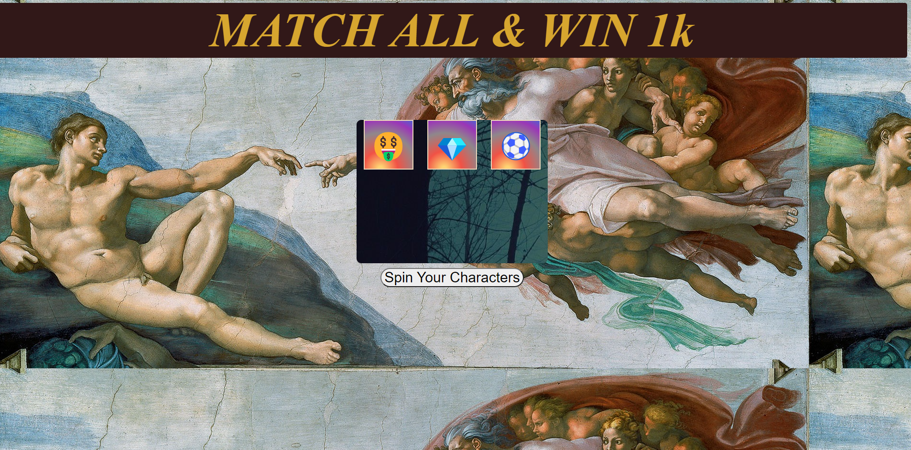

# SLOT MACHINE.  [PLAY GAME](https://kabzeel1.github.io/Unit1-Slotmachine-Project/)
# slot machines history?
Slot machine have been around for many years now, they were initally introduced in the late 1800's and played mostly in casinos and places of such.
But since we now have the power of the web we can make these games in our computers and play.

## how to play this game.

With this game you have a chance to win 1000 dollars, this will happen everytime you match the the characters in the board. 

## how the game was made.
This game was made by the help of the following programing tools.

- ***Javascript*** : this was used to bring forth the behavior of the game.

- ***HTML*** : which helped to link with all the other languages and make them compatable with the web.

- ***CSS*** : CSS helped with the styling of the game.

## Whats next?

This is not the end of the road for this app. It is sure to be evolved and made even more exciting and challenging, with spinning effects, bettings and AI in this soon coming future so ***PLEASE*** stay tuned.